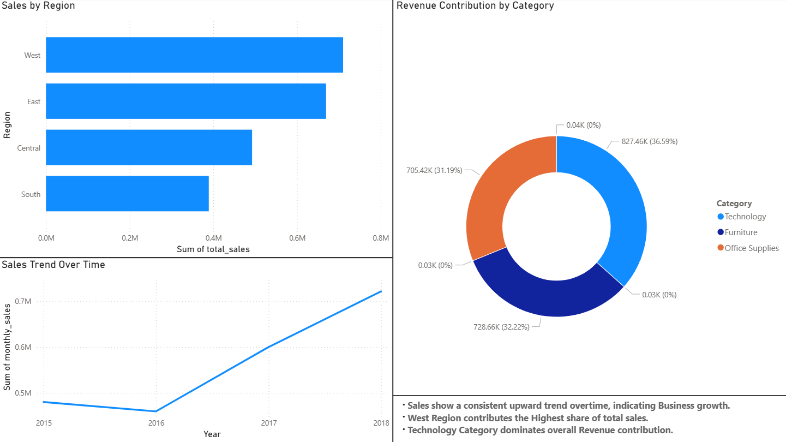
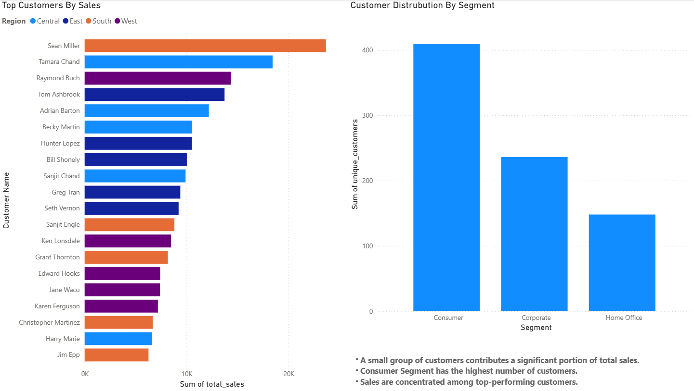
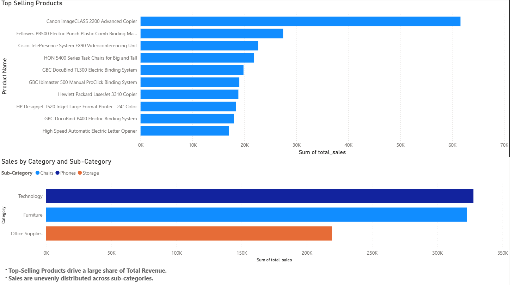
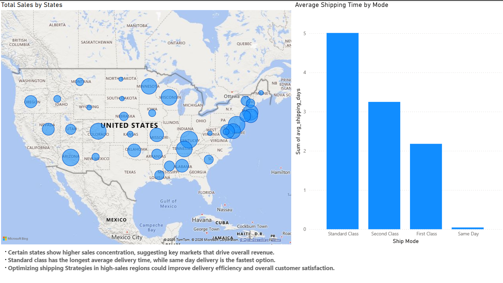
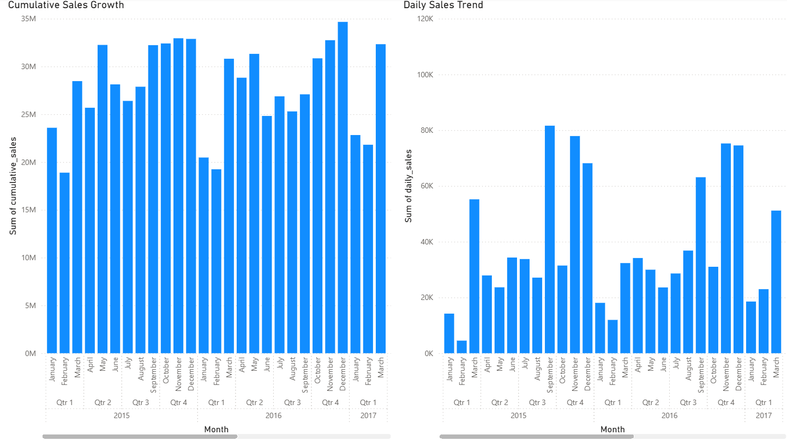

# Superstore-Sales-Analysis
Data analysis project combining SQL and Power BI to transform raw sales data into actionable insights and dashboards

🔹 Overview

This project performs an end-to-end analysis of retail sales data using SQL and Power BI. It focuses on uncovering insights related to sales performance, customer behavior, product trends, and shipping efficiency through structured queries and interactive dashboards.

🔹 Tools Used

SQL (data analysis and transformation)

Power BI (data visualization and dashboarding)

🔹 Dashboard Pages

🟦 Executive Overview

Displays overall sales trends, regional distribution, and category contribution

 

🟩 Customer Insights

Highlights top customers and customer segmentation

 

🟨 Product Performance

Identifies best-selling products and category-level performance
 

🟥 Operations & Shipping Analysis

Analyzes shipping modes and average delivery time
 

🟪 Sales Trend Analysis

Shows daily and cumulative sales trends over time
 

🔹 Key Insights

Sales are distributed across multiple regions with varying levels of contribution
A small group of customers contributes significantly to overall sales
Certain products and sub-categories drive a major share of revenue
Shipping modes differ significantly in delivery time, reflecting service-level trade-offs
Sales trends fluctuate over time with an overall growth pattern

🔹 SQL Analysis

SQL queries were used to explore the dataset and answer key business questions:

Sales by Region – Identified regional performance using aggregation
Top-Selling Products – Ranked products based on total sales
Customer Segmentation – Counted unique customers across segments
Monthly Sales Trends – Analyzed time-based sales patterns
Category & Sub-Category Analysis – Identified top-performing sub-categories within each category
Shipping Performance – Calculated average delivery time by shipping mode
Top Customers by Region – Ranked customers within each region using window functions
Cumulative Sales Trend – Generated running total of sales over time
Underperforming States – Compared state-level sales against national average
Category Contribution – Calculated percentage contribution of each category to total sales

🔹 SQL Concepts Used

Aggregations (SUM, AVG, COUNT)

Grouping (GROUP BY)

Window Functions (RANK(), SUM() OVER)

Common Table Expressions (CTEs)

Subqueries

Date Functions (DATE_TRUNC, TO_DATE)
